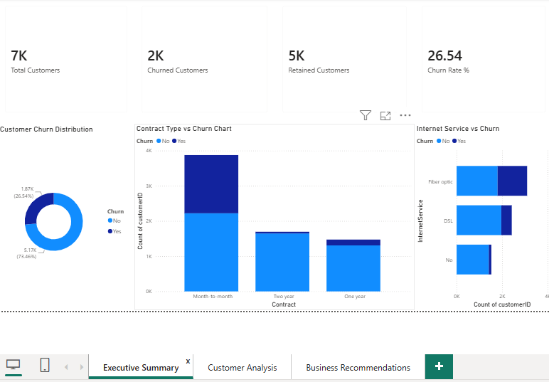
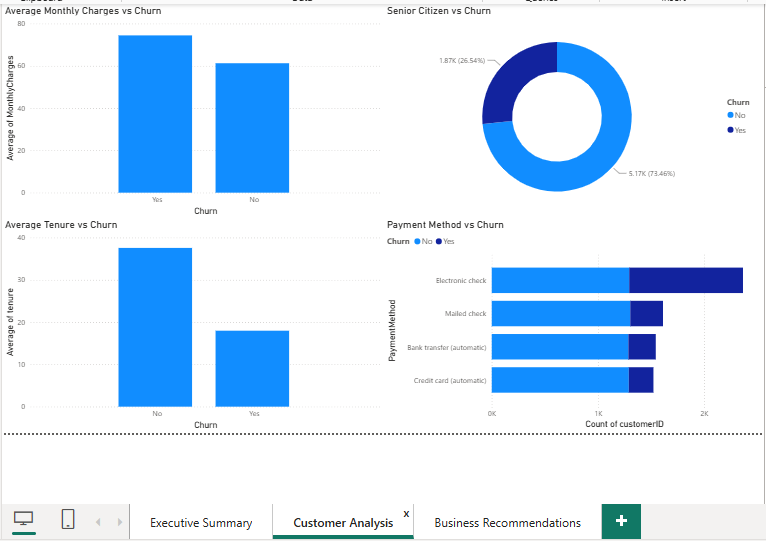
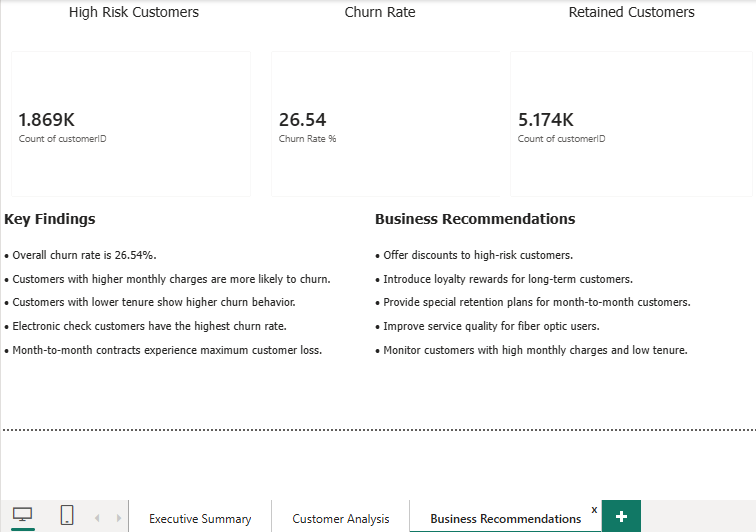
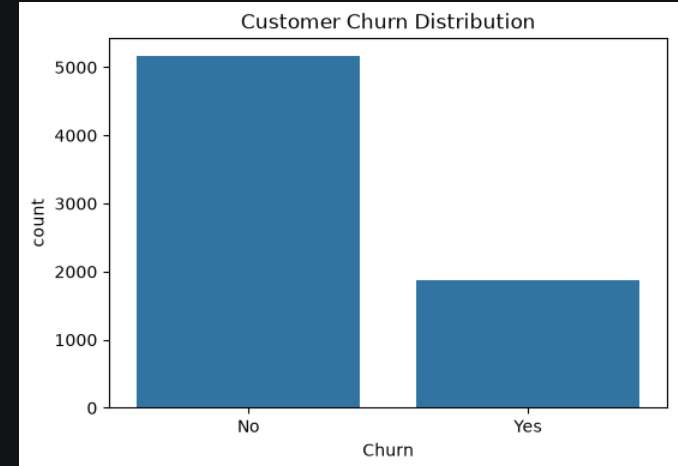
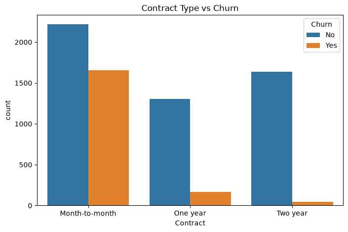
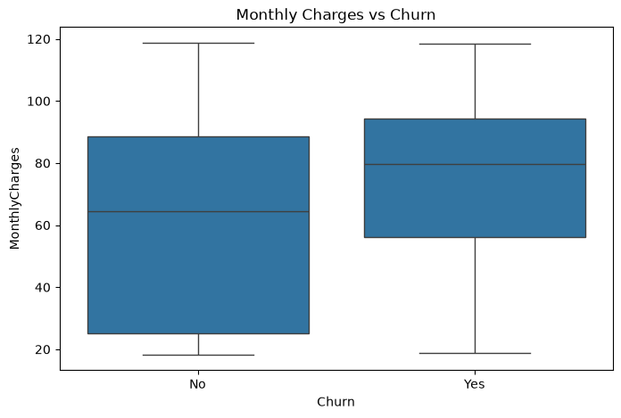
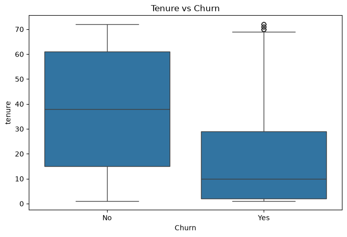
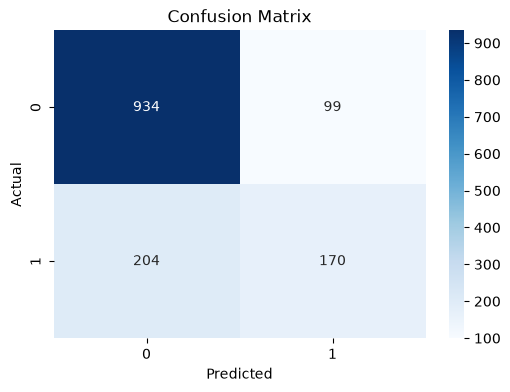

# Customer Churn Prediction & Retention Analytics

## Project Overview

This project analyzes customer churn behavior using the Telco Customer Churn dataset. The objective is to identify customers likely to leave the company, understand key churn drivers, and provide business recommendations for improving customer retention.

## Objectives

- Perform Exploratory Data Analysis (EDA)

- Conduct SQL-based business analysis

- Build a Machine Learning model for churn prediction

- Develop an interactive Power BI dashboard

- Generate business recommendations for customer retention

## Tools & Technologies

- Python

- Pandas

- NumPy

- Matplotlib

- Seaborn

- Scikit-Learn

- SQL

- Power BI

- VS Code

## Dataset Information

- Dataset: Telco Customer Churn

- Total Customers: 7043

- Churned Customers: 1869

- Retained Customers: 5174

- Churn Rate: 26.54%

## Project Workflow

1. Data Collection

2. Data Cleaning \& Preprocessing

3. Exploratory Data Analysis (EDA)

4. SQL Business Analysis

5. Machine Learning Model Development

6. Power BI Dashboard Creation

7. Business Recommendations

## Machine Learning Model

- Model: Random Forest Classifier

- Accuracy: 78.46%

## Key Findings

- Month-to-month customers have the highest churn rate.

- Customers with higher monthly charges are more likely to churn.

- Customers with shorter tenure are more likely to leave.

- Electronic check users contribute significantly to churn.

- Long-term customers show better retention.

## Business Recommendations

- Encourage customers to switch to long-term contracts.

- Offer retention discounts for high-risk customers.

- Improve customer support and service quality.

- Implement loyalty programs for long-term customers.

- Monitor customers with high monthly charges.

## Project Structure

```text
Customer_Churn_Prediction_Project/
│
├── data/
│   ├── raw/
│   │   └── WA_Fn-UseC_-Telco-Customer-Churn.csv
│   └── processed/
│       └── cleaned_churn_data.csv
│
├── notebooks/
│   └── churn_analysis.ipynb
│
├── src/
│   ├── data_cleaning.py
│   ├── eda.py
│   └── train_model.py
│
├── sql/
│   └── churn_business_queries.sql
│
├── models/
│   └── churn_model.pkl
│
├── powerbi/
│   ├── Customer_Churn_Dashboard.pbix
│   └── dashboard_screenshots/
│       ├── Executive_Summary.png
│       ├── Customer_Analysis.png
│       └── Business_Recommendations.png
│
├── images/
│   ├── Customer_Churn_Distribution.png
│   ├── Contract_Type_vs_Churn.png
│   ├── Monthly_Charges_vs_Churn.png
│   ├── Tenure_vs_Churn.png
│   └── Confusion_Matrix.png
│
├── reports/
│   ├── EDA_Report.docx
│   ├── SQL_Business_Analysis.docx
│   ├── Model_Performance_Report.docx
│   └── PowerBI_Dashboard_Report.docx
│
├── README.md
├── requirements.txt
└── .gitignore
```

## Dashboard Preview

### Executive Summary



### Customer Analysis



### Business Recommendations



## Customer Churn Analysis

### Customer Churn Distribution



### Contract Type vs Churn



### Monthly Charges vs Churn



### Tenure vs Churn



### Confusion Matrix




## Author

Syed Mohammed Saad


